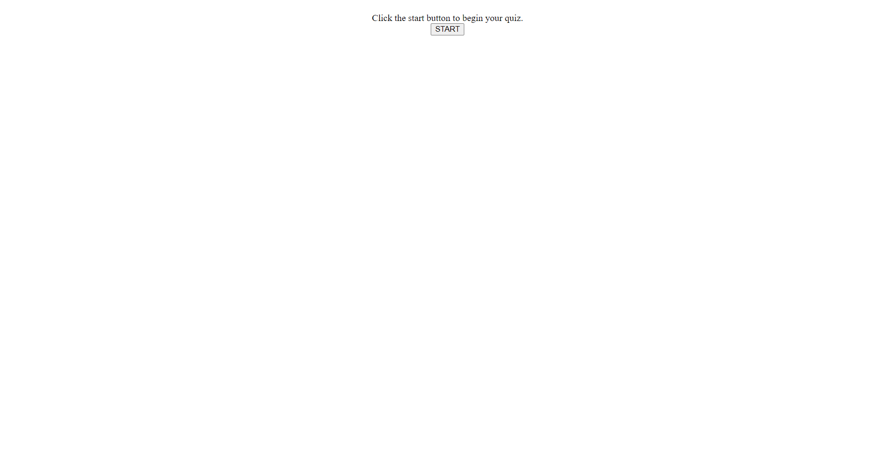

# Play the Quiz

## Description

The motivation for this project was to create a quiz that is timed and will let you save your highscore when you complete the quiz or run out of time.

## Usage

To navigate on the web application, you click the start button which will begin the timer and prompt the first question of the quiz. If you select the wrong answer, it will remove 5 seconds from the timer. If you click the correct answer it will go to the next question. This will continue until all questions have been answered or the timer reaches zero. A window will pop up GAME OVER. Then you will be able to input your initials and save your score.

## Application Image and Link

The following image shows the web application's appearance. You can also go to the web application by clicking the following link. https://chelleyoungw.github.io/play-the-quiz/

 
## Credits

Chelle Wood (student)

## License

Please refer to the MIT LINCESE in the repo.